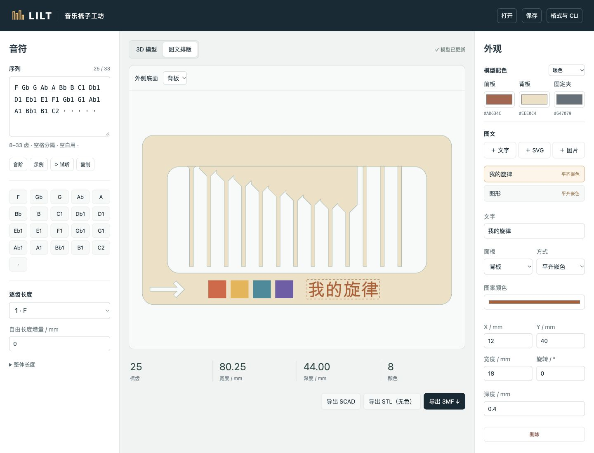

# LILT — 音乐梳子生成器

LILT 将音符序列转换为可手动拨奏的 3D 打印音乐梳子。通过本地网页编辑旋律、调节梳齿长度、排版文字与图案，也可以使用 CLI 批量生成模型。



## 功能

- **旋律建模**：支持 20 个半音音符、重复音和停顿，自动生成前板、背板与固定夹。
- **模型调整**：支持 8–33 个梳齿位置，可调节整体齿长与单齿自由长度。
- **图文与配色**：导入 SVG、PNG、JPEG 或 WebP，添加文字，调整位置、尺寸与旋转；支持凹刻、凸起和平齐多色嵌色。
- **模型导出**：生成 STL、3MF 和可独立编辑的 OpenSCAD 文件，使用 JSON 保存或复现方案。
- **Agent 工作流**：提供 CLI 和读谱 Skill，将歌曲片段整理为音符序列并生成模型。

## 快速开始

需要 Python 3.9–3.12。以下命令适用于 macOS 和 Linux：

```sh
git clone https://github.com/ChambersXDU/music-comb-studio.git
cd music-comb-studio
python3 -m venv .venv
source .venv/bin/activate
python -m pip install -r requirements.txt
python -m comb serve --port 8818
```

在浏览器打开 **http://127.0.0.1:8818**。服务运行期间保持终端开启，按 `Ctrl+C` 停止。macOS 也可双击仓库中的 `启动音乐梳子.command`，自动安装依赖并启动网页。

将音符序列粘贴到“序列”字段，模型会自动更新。在“图文排版”中编辑图层，选择导出格式后将模型导入切片软件。使用“保存”和“打开”管理 JSON 方案。

模型生成不需要安装 OpenSCAD；编辑或渲染导出的 `.scad` 文件时才需要它。网页资源随项目提供，启动后无需访问 CDN。

## 音符序列

支持的音符按音高递增排列：

```text
F Gb G Ab A Bb B C1 Db1 D1 Eb1 E1 F1 Gb1 G1 Ab1 A1 Bb1 B1 C2
```

使用空格、逗号或换行分隔音符，支持对应的升号写法，例如 `F#` 等同于 `Gb`。重复音符表示再次拨奏；`·` 标记停顿。每个音符或停顿占一个梳齿位置，总数为 8–33。

示例：

```text
C1 C1 G1 G1 A1 A1 G1 · F1 F1 E1 E1 D1 D1 C1
```

序列中的 `C1` 是项目音符标签，试听对应科学音高 C4；完整试听音域为 F3–C5。试听使用固定间隔，停顿不发声，实物演奏的速度与停顿长短由拨奏者控制。

## 命令行

以下命令在项目根目录、已激活虚拟环境的终端中运行。

根据序列生成模型：

```sh
python -m comb generate \
  --notes "C1 C1 G1 G1 A1 A1 G1 · F1 F1 E1 E1 D1 D1 C1" \
  --out outputs/melody
```

默认输出 `.stl`、`.3mf`、`.scad`、`.json` 和 `.manifest.json`。`--out` 指定输出文件名前缀；`--format stl|3mf|scad` 可选择单一模型格式。

添加多色 SVG，以平齐嵌色方式生成两面图案：

```sh
python -m comb generate \
  --config examples/melody.json \
  --svg examples/multicolor.svg --target both \
  --mode inlay --width 22 --y 40 \
  --out outputs/decorated
```

复现网页保存的方案，或查看全部参数：

```sh
python -m comb generate --config plan.json --out outputs/restored
python -m comb generate --help
```

图层字段、颜色、尺寸参数和 SCAD 编辑方法见 [参数参考](docs/reference.md)。

## 导出与打印

| 格式 | 使用场景 |
| --- | --- |
| **3MF** | 多色打印。保留零件、材料区域和颜色，在切片软件中分配对应耗材。 |
| **STL** | 单色打印。包含三个零件的平铺摆盘，不保存颜色。 |
| **SCAD** | 在 OpenSCAD 中修改音符、尺寸、配色和图文，重新生成模型。 |
| **JSON** | 保存编辑方案，在网页或 CLI 中重新载入。 |
| **manifest.json** | 获取齿数、尺寸、逐齿参数和网格信息，供程序核对。 |

多色或平齐嵌色图案使用 3MF 导出。生成的 3MF 为通用模型文件，打印机、耗材与切片参数需在切片软件中配置。

打印件的音高受材料和打印参数影响，需要试印后逐齿调音。停顿位置采用未调音细齿，演奏时应跳过或停手。文字生成依赖本机字体；中文需要包含中文字形的字体。SVG 使用纯色填充形状，文字和描边需先转轮廓，渐变需转为纯色区域。

## 读谱 Skill

仓库附带 [music-comb-score](skills/music-comb-score/SKILL.md)，用于让 Codex 查找并读取旋律谱，简化装饰音、统一移调、保留停顿，输出可复制序列和方案 JSON。Skill 要求保留谱源与简化记录；其中的转换脚本处理已转写音符，不执行图像识谱。

在项目根目录安装：

```sh
mkdir -p ~/.codex/skills
cp -R skills/music-comb-score ~/.codex/skills/
```

在新的 Codex 对话中调用：

```text
$music-comb-score 为指定歌曲片段找谱，简化快速转音，保留停顿，
输出音乐梳子序列和方案 JSON。
```

音高事件格式与转换脚本用法见 [Skill 序列参考](skills/music-comb-score/references/sequence-format.md)，可运行 [事件示例](examples/score-events.json) 完成从转写到模型的转换：

```sh
python skills/music-comb-score/scripts/make_sequence.py \
  --input examples/score-events.json --transpose -5 --out outputs/score-plan.json
python -m comb generate --config outputs/score-plan.json --out outputs/score-comb
```

## 开发

`comb/` 提供建模、图文处理、导出和本地 HTTP 服务，`web/` 提供网页编辑器，`assets/` 存放基础几何，`skills/` 存放读谱 Skill。网页和 CLI 使用同一套建模代码。

运行 Python 测试，以及前端序列测试（需 Node.js）：

```sh
python -m unittest discover -s tests -v
node tests/test_sequence.mjs
```

## 来源与许可证

模型结构基于 [Musical Fidget Generator v4](https://makerworld.com/zh/makerlab/parametricModelMaker?designId=1492688) 的参考几何重建。来源与测量记录见 [provenance.json](evidence/provenance.json)。

软件代码、Skill 和文档使用 [MIT 许可证](LICENSE)。参考及衍生几何的授权范围，以及第三方组件信息，见 [NOTICE.md](NOTICE.md)。
